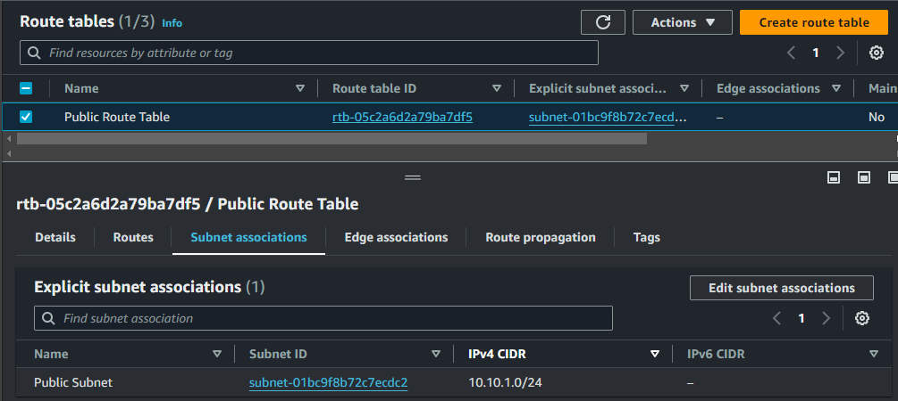

# Deploy-Web-Server-With-Terraform

## Demo Project

First, you need to create an access/ secret key on AWS Management Console for this project and after you complete this project, you must delete you access key immediately

- Clone this project
```
git clone https://github.com/thnbao22/Deploy-Web-Server-With-Terraform.git
```

- After you clone this project, please open the project and run the command in Visual Studio Code
```
terraform init
```
- Remmember to cd to folder terraform :v


- After run the command **terrform init** successfully, you can run the following command
```
terraform plan
```


- You will see some things happen after run the command.


- Then you can run the command **terraform apply --auto-approve**
```
terraform apply --auto-approve
```


- You will see that your resources is being created.

- VPC:
  


- Subnet:


- Route Table:


- Subnet Associations:



- Internet Gateway:


- Security Group:


- Inbound Rules:


- Web server Instance information:


- Check the Apache Web server by using public IPv4 address of EC2 instance:


- After seeing web server, you can run the command **terraform destroy --auto-approve**
```
terraform destroy --auto-approve
``` 
- And remmember to delete the keypair and access/secret key
